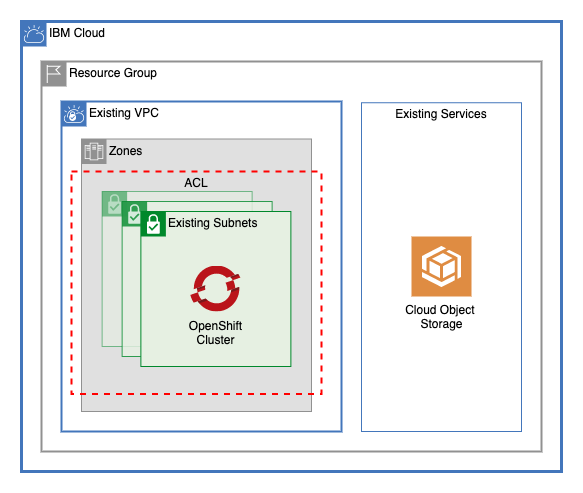

# OpenShift Cluster on Existing VPC

This module creates a Red Hat OpenShift cluster on existing VPC infrastructure.

## Table of Contents

1. [Pre-requisites](##Pre-requisites)
2. [Default Kube Version](##default-kube-version)
3. [Red Hat OpenShift Cluster](##red-hat-openshift-cluster)
4. [Module Variables](##module-variables)
5. [Module Outputs](##module-outputs)

---

## Pre-requisites

This module requires the following to create an OpenShift cluster: 

- An existing VPC with subnets
- An existing Cloud Object Storage instance

---

## Default Kube Version

This module optionally allows users to use the `default` OpenShift versions with the [default_kube_version.sh](./default_kube_version.sh) script. This script uses the IBM Containers API to retrieve the most recent default version of OpenShift. To use the default version, leave the `kube_version` as `"default"`.

## Red Hat OpenShift Cluster

This module creates a Red Hat OpenShift Cluster across all the subnets in the `var.subnets` variable. This module can also dynamically create additional worker pools across the subnets.

---

## Module Variables

Name             | Type                                                                            | Description                                                                                                                                                                                                                                                                                                                                                                                                                                                                         | Sensitive | Default
---------------- | ------------------------------------------------------------------------------- | ----------------------------------------------------------------------------------------------------------------------------------------------------------------------------------------------------------------------------------------------------------------------------------------------------------------------------------------------------------------------------------------------------------------------------------------------------------------------------------- | --------- | -----------------
ibmcloud_api_key | string                                                                          | The IBM Cloud platform API key needed to deploy IAM enabled resources                                                                                                                                                                                                                                                                                                                                                                                                               | true      | 
TF_VERSION       |                                                                                 | The version of the Terraform engine that's used in the Schematics workspace.                                                                                                                                                                                                                                                                                                                                                                                                        |           | 1.0
prefix           | string                                                                          | A unique identifier need to provision resources. Must begin with a letter                                                                                                                                                                                                                                                                                                                                                                                                           |           | asset-roks
region           | string                                                                          | IBM Cloud region where all resources will be deployed                                                                                                                                                                                                                                                                                                                                                                                                                               |           | 
resource_group   | string                                                                          | Name of resource group where all infrastructure will be provisioned                                                                                                                                                                                                                                                                                                                                                                                                                 |           | asset-development
vpc_name         | string                                                                          | Name of VPC where cluster is to be created                                                                                                                                                                                                                                                                                                                                                                                                                                          |           | 
subnets          | list(string)                                                                    | A list of subnet IDs where the cluster will be created                                                                                                                                                                                                                                                                                                                                                                                                                              |           | 
cos_instance     | string                                                                          | Name of the COS Instnance for the cluster to use                                                                                                                                                                                                                                                                                                                                                                                                                                    |           | 
machine_type     | string                                                                          | The flavor of VPC worker node to use for your cluster. Use `ibmcloud ks flavors` to find flavors for a region.                                                                                                                                                                                                                                                                                                                                                                      |           | bx2.4x16
workers_per_zone | number                                                                          | Number of workers to provision in each subnet                                                                                                                                                                                                                                                                                                                                                                                                                                       |           | 2
entitlement      | string                                                                          | If you purchased an IBM Cloud Cloud Pak that includes an entitlement to run worker nodes that are installed with OpenShift Container Platform, enter entitlement to create your cluster with that entitlement so that you are not charged twice for the OpenShift license. Note that this option can be set only when you create the cluster. After the cluster is created, the cost for the OpenShift license occurred and you cannot disable this charge.                         |           | cloud_pak
kube_version     | string                                                                          | Specify the Kubernetes version, including the major.minor version. To see available versions, run `ibmcloud ks versions`. To use the default version, leave as `default`.                                                                                                                                                                                                                                                                                                           |           | default
pod_subnet       | string                                                                          | pecify a custom subnet CIDR to provide private IP addresses for pods. The subnet must have a CIDR of at least /23 or larger.                                                                                                                                                                                                                                                                                                                                                        |           | 172.30.0.0/16
service_subnet   | string                                                                          | Specify a custom subnet CIDR to provide private IP addresses for services. The subnet must be at least ’/24’ or larger.                                                                                                                                                                                                                                                                                                                                                             |           | 172.21.0.0/16
wait_till        | string                                                                          | To avoid long wait times when you run your Terraform code, you can specify the stage when you want Terraform to mark the cluster resource creation as completed. Depending on what stage you choose, the cluster creation might not be fully completed and continues to run in the background. However, your Terraform code can continue to run without waiting for the cluster to be fully created. Supported args are `MasterNodeReady`, `OneWorkerNodeReady`, and `IngressReady` |           | IngressReady
tags             | list(string)                                                                    | A list of tags to add to the cluster                                                                                                                                                                                                                                                                                                                                                                                                                                                |           | []
worker_pools     | list(object({ name = string machine_type = string workers_per_zone = number })) | List of maps describing worker pools                                                                                                                                                                                                                                                                                                                                                                                                                                                |           | []
cos_id           | string                                                                          | ID of COS instance                                                                                                                                                                                                                                                                                                                                                                                                                                                                  |           | null
kms_guid         | string                                                                          | GUID of Key Protect Instance                                                                                                                                                                                                                                                                                                                                                                                                                                                        |           | null
key_id           | string                                                                          | GUID of User Managed Key                                                                                                                                                                                                                                                                                                                                                                                                                                                            |           | null

---

## Module Outputs

Name                          | Description                               | Sensitive | Depends On                            | Value
----------------------------- | ----------------------------------------- | --------- | ------------------------------------- | -----------------------------------------------------------------------------
id                            | ID of cluster created                     |           | [ ibm_container_vpc_cluster.cluster ] | ibm_container_vpc_cluster.cluster.id
name                          | Name of cluster created                   |           | [ ibm_container_vpc_cluster.cluster ] | ibm_container_vpc_cluster.cluster.name
private_service_endpoint_url  | URL For Cluster Private Service Endpoint  |           |                                       | ibm_container_vpc_cluster.cluster.private_service_endpoint_url
private_service_endpoint_port | Port for Cluster private service endpoint |           |                                       | split(":", ibm_container_vpc_cluster.cluster.private_service_endpoint_url)[2]
